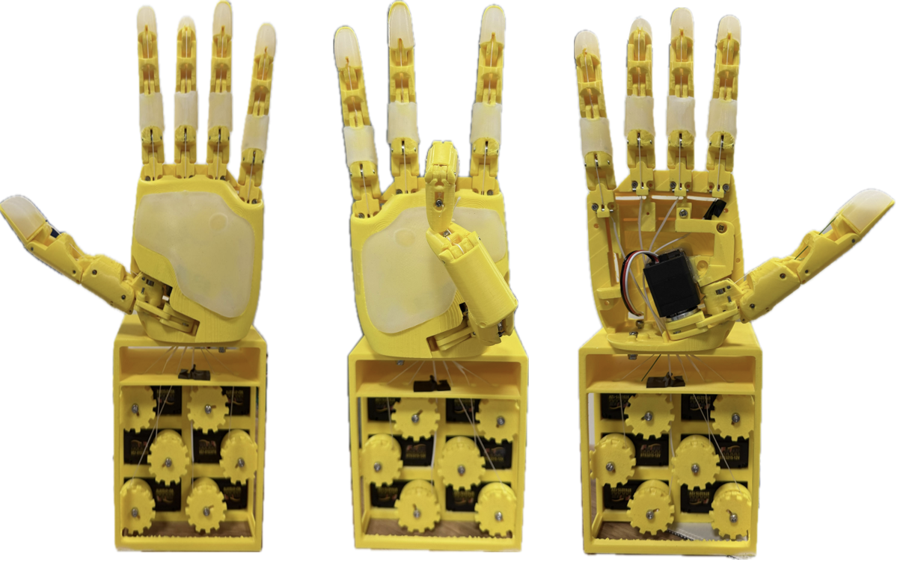
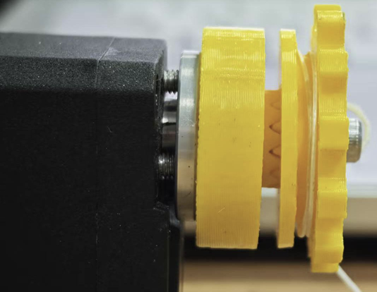
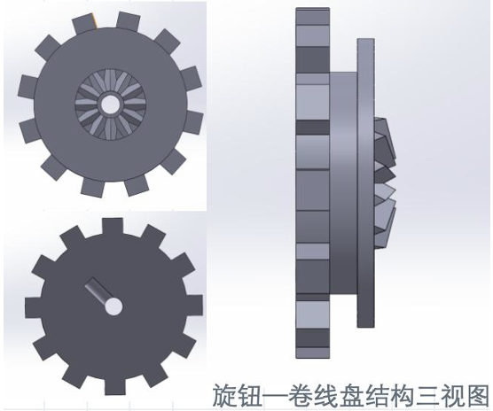
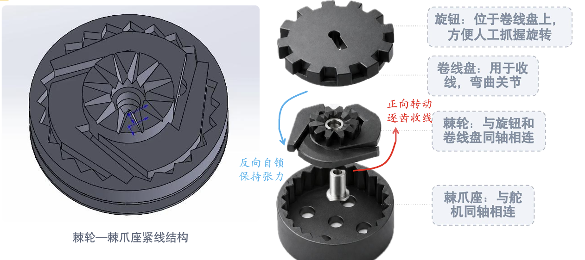

# 基于 MediaPipe 的灵巧手视觉遥操作

**人手动作输入 · 七路执行器映射 · 双模式控制 · 实机演示**



基于开源 AeroHand 的腱驱灵巧手课程项目。通过电脑摄像头与 MediaPipe 获取人手关键点，将手指姿态映射为七路执行器控制量，结合本地 Web 上位机和串口通信，实现视觉连续跟随与预设手势调用。

**浙江大学 · 机械工程课程实践 · 2026.07–2026.08**  
项目已完成实机联调与现场路演。本仓库记录项目成果、技术实现与个人贡献。

## 实机演示

### 视觉连续跟随 · 约 39 秒

电脑摄像头识别人手姿态，经映射后驱动灵巧手连续跟随。

https://github.com/user-attachments/assets/df0cb85b-9df9-4ab4-b6d7-cffbc413f2c2

### 抓握与手势变化 · 约 31 秒

展示不同物体的抓握和手势切换；物体由人工放置，并非自主视觉抓取。

https://github.com/user-attachments/assets/7b15424b-a8ad-4391-b398-24331e95d8f8

两段视频均保留原始时序，压缩并静音处理，未加速。

## 01 / 实现了什么

| 功能 | 实现内容 |
| --- | --- |
| 视觉连续跟随 | 通过摄像头识别人手关键点，将手指姿态转换为执行器控制目标，驱动灵巧手随人手动作变化 |
| 预设手势调用 | 调用预先配置的动作，完成指定手势展示与功能验证 |
| 本地 Web 控制 | 以网页作为设备操作入口，连接 Python/FastAPI 控制服务与舵机通信模块 |
| 执行器标定与调试 | 对舵机运动端点与控制参数进行配置，结合实机动作开展联调 |

这里的“七路”指执行器控制通道，不等同于七个完全独立的手指关节；腱驱机构中存在关节耦合。

## 02 / 系统如何工作

```text
视觉连续跟随
电脑摄像头 → MediaPipe 手部关键点 → 手指姿态映射
                                      ↓
                              七路执行器控制目标
                                      ↓
                           控制程序 → 串口 → 舵机
                                                ↓
                                          腱驱灵巧手

预设手势调用
本地 Web 控制台 → 预设动作 → 控制程序 → 串口 → 舵机
```

### 视觉输入与动作映射

集成 MediaPipe 手部关键点检测，将检测结果转换为适合灵巧手执行的控制量，贯通视觉输入、姿态映射与实机动作执行。

### 双模式控制

- **连续跟随模式：** 根据人手姿态持续更新机器人控制目标。
- **预设手势模式：** 根据已配置动作执行指定手势，用于演示和功能验证。

### 上位机与硬件通信

以 Python/FastAPI 本地 Web 控制台组织设备操作，通过 FE-URT-2 与 STS3215 总线舵机交互，完成指令下发与相关状态交互。实机运行依赖当前硬件配置及对应标定参数。

## 03 / 我的工作

这是一个团队课程项目。个人工作重点是控制需求梳理、上位机功能迭代、运动端点标定与实机联调，以及视觉交互功能验证和项目展示。

- 梳理控制与交互需求，参与控制台功能迭代，将设备操作和演示需求落实到可验证的功能。
- 完成运动端点标定与控制参数配置，结合硬件响应进行调试。
- 参与视觉输入到灵巧手动作的集成与验证，完成双模式功能的实机展示。
- 参与灵巧手装配、测试及展示材料整理，完成现场路演。

软件迭代使用 AI 编程工具辅助，个人工作侧重功能需求、集成验证、硬件标定与实机调试。

## 04 / 团队结构实践：棘轮式腱绳张紧

针对腱绳张紧与调整需求，团队采用旋钮、卷线盘与棘轮—棘爪座组合结构。旋钮带动卷线盘逐齿收线，棘轮机构限制反向回转，便于调节并保持腱绳张力。

| 结构实物 | CAD 结构视图 |
| --- | --- |
|  |  |



本节展示团队结构成果；个人职责见“我的工作”，不将上述全部 CAD 设计归为个人独立完成。

## 05 / 技术组成

| 层次 | 工具或内容 |
| --- | --- |
| 视觉感知 | 电脑摄像头、MediaPipe 手部关键点检测 |
| 动作处理 | 人手姿态到七路执行器控制量的映射 |
| 交互界面 | 本地 Web 控制台 |
| 控制服务 | Python、FastAPI |
| 通信与执行 | 串口通信、FE-URT-2、STS3215 总线舵机 |
| 实体平台 | 基于 AeroHand 的腱驱灵巧手 |

## 06 / 验证与迭代

目前完成双模式控制的实机功能演示。连续跟随仍存在延迟和部分姿态映射误差；尚未给出统一测试条件下的时延、跟随误差或更新频率指标。

后续可围绕三个方向继续验证：

1. **跟随效果：** 在明确光照、距离和动作条件下记录映射偏差。
2. **响应时延：** 分别观察视觉处理、软件通信与机械执行环节的影响。
3. **运行边界：** 验证遮挡、识别丢失、通信异常等场景下的系统行为。

以上为后续验证方向，不代表已经完成的性能优化或安全认证。

## 07 / 来源与说明

- 原始开源项目：[TetherIA / Aero Hand Open](https://github.com/TetherIA/aero-hand-open)。
- 本项目为基于开源平台的课程实践、系统集成与功能扩展，不将原始机械设计或第三方模型表述为个人原创。
- 当前仓库以项目展示为主，包含真实图片、演示视频与技术说明，暂不提供通用软件安装包。
- 如后续加入代码、CAD 或第三方文件，应保留对应来源与许可信息，并确认团队材料可公开。
- 实机操作前应核对硬件接线、舵机编号、运动范围和停止方式；本页面不是设备安全操作规程。
